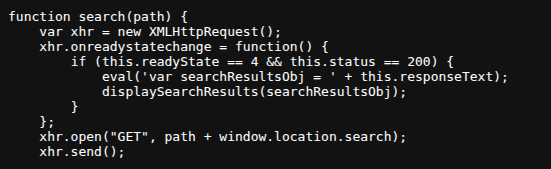
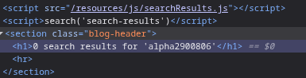
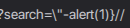
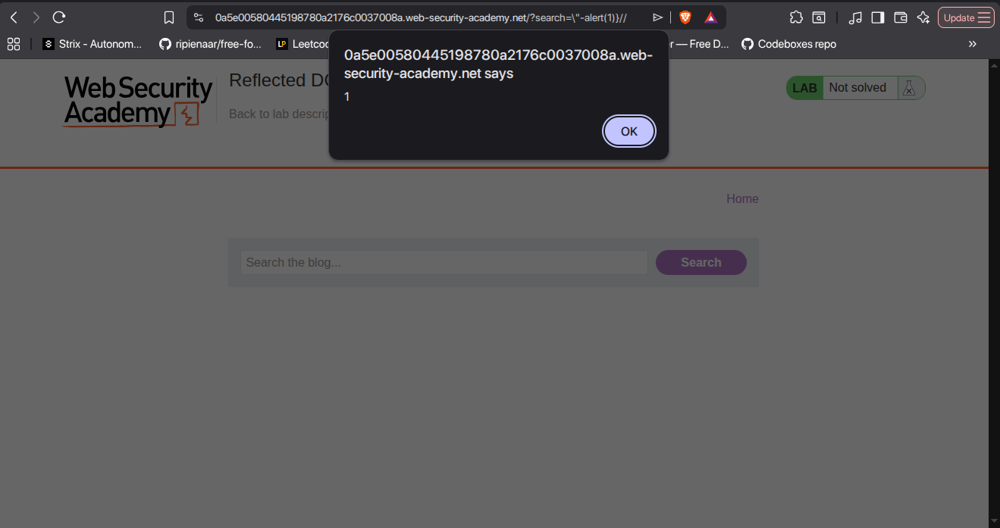

# Lab on DOM Reflected XSS
- \
Sink in JS Code

- \
The Search functionality code.
- I searched for "alpha2900806"
- Then I turned on the burp suite intercept and then I sent "alert(1) and then I noticed that URL was escaping the quotations.
- So for that purpose I applied a <code>\\</code> so that when the server adds a backslash to escape the <code>\"</code> then my backslash will basically cancel it and hence the original double quoted string is used to close the string where the value is stored in the server.
- Next after that I applied a closing curly bracket for closing the object and then two <code>//</code> for commenting the rest part.
- Even then the payload didn't work, then I used <code>-</code> to instruct js to execute alert(1) first.
So the final payload was like this:
- 
And with this the final output came:
-