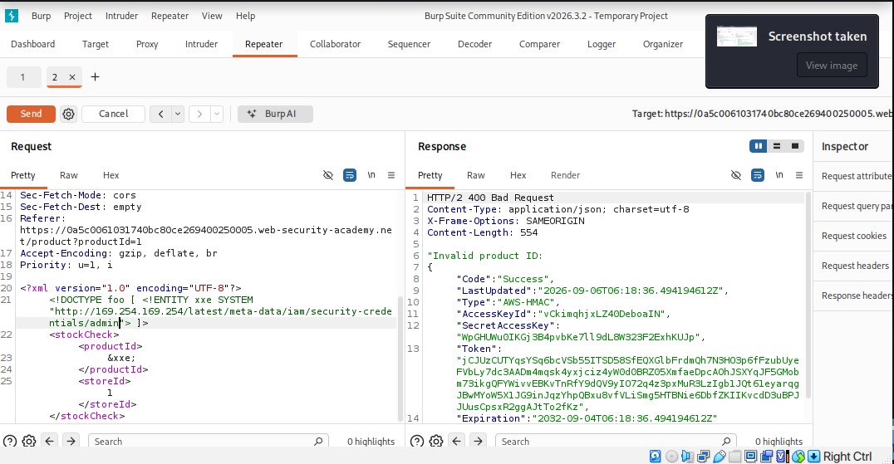

# XXE with external website. (SSRF Attack)

- 

- At first when I just accessed http://169.254.169.254/ , it gave me reponse invalid productid: latest. So, at first i thought that latest is the IAM SecretAccessKey.
- But actually it is the folder name that was being returned to me. So, by refering to the solution, I started adding the response to the url so that I can change the directory to the next one.
- After some time, the actual response came that contained the JSON of the secret credentials including SecretAccessKey.

- The purpose of documenting this lab is because I had no idea about this lab, how to solve it. 